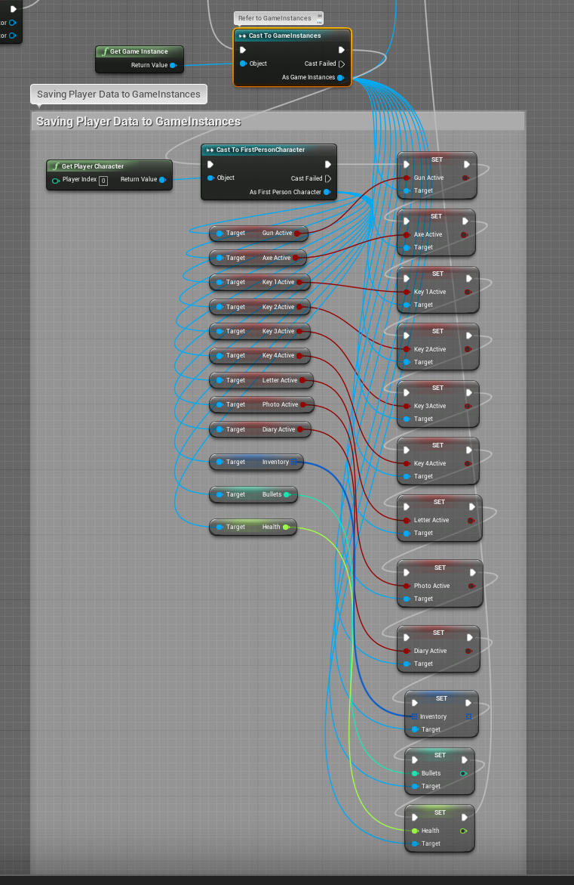
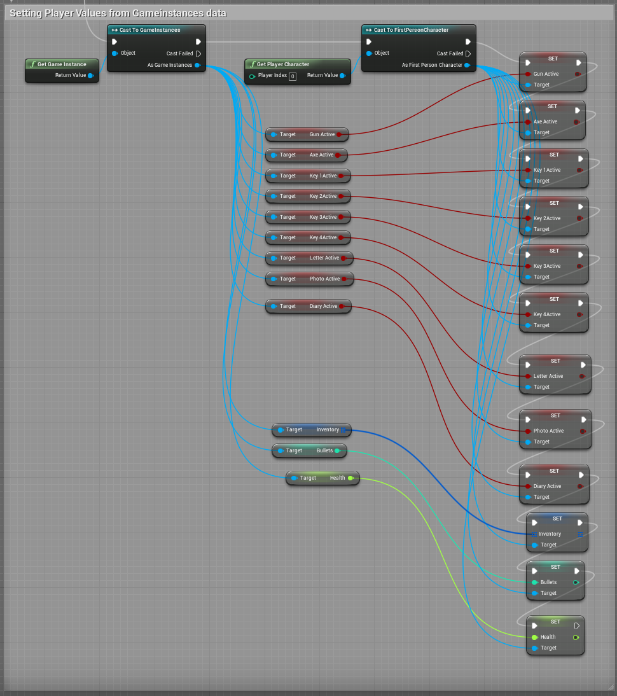

### Abdullah Bin Abdullah
# Introduction

For this game project, I had the responsibility of making sure git was working well enough for my other team members to work without worry. I contributed some mechanics like opening doors with keys and transferring items and variables to other levels in this project. I will explain some issues that came up when the team has handling the project with git and GitHub as well as the contributions I made to the game.

# git and Git LFS

At the beginning of the project, we had trouble handling Unreal because of their decision to keep binary files into their workflow. Our test project was also too big to upload to GitHub in one go. This was when the decision to use Git LFS was made. Advice from users of Git LFS found on the Internet suggested that Git LFS should be used to track binary files that have reached a certain filesize but to keep complexity down and because SourceTree, the versioning software every team member uses, tracks by filetype instead of individual files, all the uassets and umaps were tracked by Git LFS.

This lead to the next problem which was that Git LFS support on GitHub was free up until the monthly bandwidth limit was reached. GitHub allows for 1GB in bandwidth and storage. Unaware of such a limit, the team was cloning the project multiple times in order to get used to using git with the Unreal project and handling binary files. This lead to us reaching the limit very quickly and had to pay to raise the limit.

To date, this is the usage for Git LFS for this project on GitHub. When you buy a data pack to increase the quota, keep in mind that it is more like a subscription that a one-off expansion. Other problems encountered when introducing Git LFS is that sometimes when you clone the project, you are met with a black screen in the editor window. This is either because the version on the computer is different than the one that made the project or Git LFS hasn't pulled the assets from the server properly. 

# git merge problems

Sometimes when a team member pushes their commit to the remote repository at the same time as another, it can cause conflicts and git forces them to merge their commits. This can cause loss data and any changes down which we did experience. I tried to mitigate this by creating a readme that showed step-by-step what to do when your commits are simultaneously ahead and behind the remote repository. But sometimes these problems are unavoidable, for example, our main umap was missing because the git didn't know how to handle LFS data therefore corrupting the data. The solution was to revert to an earlier commit, copy the umap and builtdata and commit them as new changes in the latest commit.

# Locking the doors

Locking the doors in Unreal was pretty simple. All it takes is a branch node requiring a certain key to be active. These keys are activated just by picking them up into your inventory. There are multiple places that this blueprint was copied to. One for each door that we wanted locked or a level transition we wanted to restrict until the player has a certain item.

# Persistent inventory through levels

SCP093 is made up of multiple levels. During early development, when transitioning from one level to another, the items in your inventory disappear and variables that set functionality like AxeActive are reset. This is because the data isn't carried over when the player moves to a different level. A game instance blueprint solves this problem. Because Wu created the GameInstance to transfer the player over to a different level, all I had to do was add variables to the game instance and set them using the player's variables.

A similar process has to be done at the start of a every level the player goes through. Just like how data must be saved to game instance before transfering to the next level. Data must be transferred back to the player at the start of entering a level. This allows the player to unlock doors in the bunker using a key found in the main map for example.

